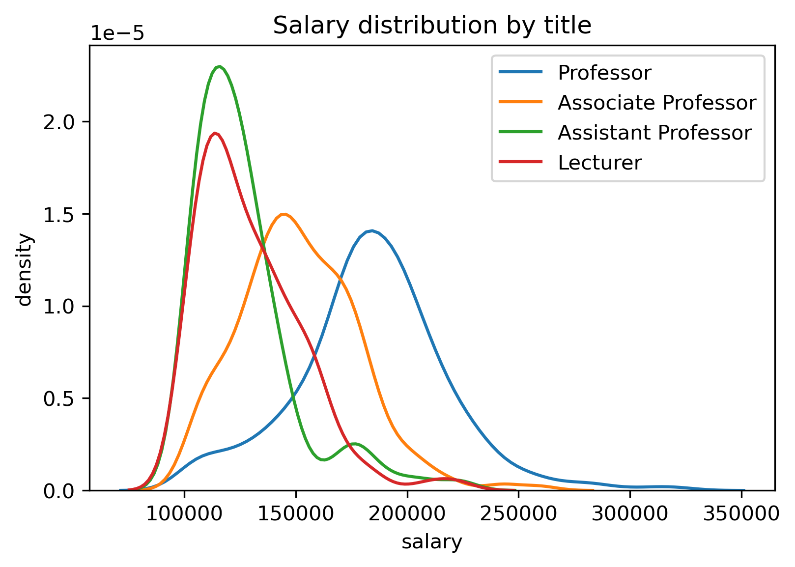

# Prof ratings

Use course evaluations to predict who will get tenure and more!

## Scraper
`scrape.py` downloads:
- Course evaluations from mathsoc website (into `scraped_data` folder), needs UW login (hardcoded)
- Staff salaries from uwaterloo website (into `salaries` folder)
- Class sizes from "Schedule of Classes" (into `catalog` folder)

Uncomment the lines at the end of the file to run them.

## Data preprocessing
`process.py` takes all the course evaluations downloaded by the scraper and combines them into a single csv. 
Currently it just aggregates survey responses by averaging (ignoring "No opinion") and outputs `averages.csv`. Lower scores are better.
It also joins the enrolment numbers and calculates response rates, outputting `averages_enrol.csv`.

`fix.py` then modifies the names in `salaries` folder to match those in the course evaluations. 

## Data analysis
The jupyter notebook files contain some visualization and analysis.

So far I tried:
- Remove surveys with <=10 responses and instructors with <=2 courses, we're left with 3120 classes across 312 course codes and 352 profs.
- Linear regression on overall score vs. other survey responses is R^2=0.9999988686940563 (not collinear in features though)
- Logistic regression to predict tenure (Prof or Associate Prof) is better than random but ends up with some odd coefficients
- Lots of looking up random profs

Things to try:
- preprocess surveys in other ways (ex. use median or change "too much/too little" questions)
- predict title (multi-class), do pca, other algorithms
- write about how interesting the dataset is
- do some rankings (see [blog post](https://medium.com/@uw_data_scientist/analyzing-uw-math-faculty-course-evaluations-4eee687ffd65) for inspiration)

## Other stuff
`bai` folder is someone else's code (they emailed it to me to help with some missing data)