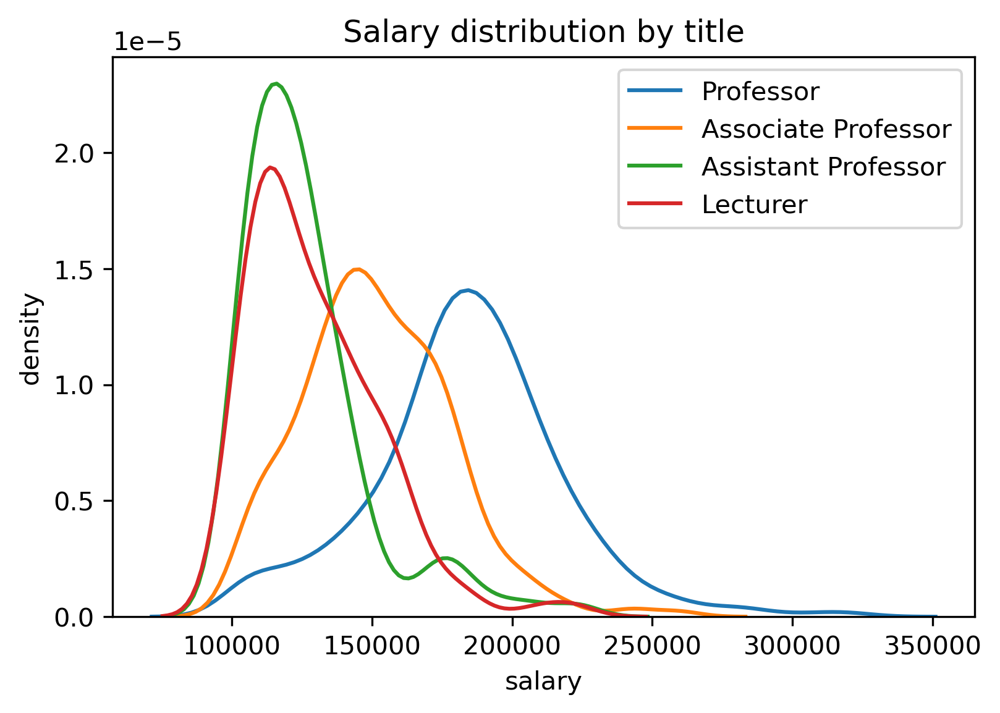

# A Statistical Analysis of UWaterloo Math Faculty Course Evaluations

Michael Pang, Jiachen Wang, Jeffrey Zhao

---

Use course evaluations to predict who will get tenure and more!

## Scraper
`scrape.py` downloads:
- Course evaluations from mathsoc website (into `scraped_data` folder), needs UW login (hardcoded)
- Staff salaries from uwaterloo website (into `salaries` folder)
- Class sizes from "Schedule of Classes" (into `catalog` folder)

Uncomment the lines at the end of the file to run them.

## Data Preprocessing
`process.py` takes all the course evaluations downloaded by the scraper and combines them into a single csv. 
Currently it just aggregates survey responses by averaging (ignoring "No opinion") and outputs `averages.csv`. Lower scores are better.
It also joins the enrolment numbers and calculates response rates, outputting `averages_enrol.csv`.

`fix.py` then modifies the names in `salaries` folder to match those in the course evaluations. 

## Data Analysis and Modelling
There are multiple Jupyter notebooks that contain the source code performing the data analysis and constructing the classifiers explored in the report:
 - EDA.ipynb: Elementary data analysis performed. Generates Sections 1-3.
 - Viz.ipynb: Data visualization. Generates Sections 1-3.
 - classifier_comparisons.ipynb: Constructs and explores classifiers. Generates Sections 4-5.
 - Analysis.ipynb: Performs further, deeper analysis and aims to answer questions about the dataset. Generates Section 6.

## Other Stuff
`bai` folder is someone else's code (they emailed it to me to help with some missing data)
